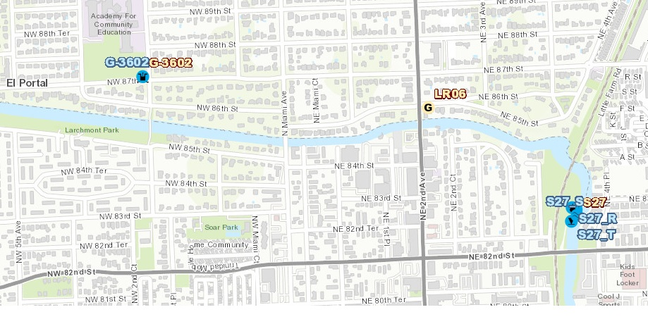

```{r setup, include=FALSE}
knitr::opts_chunk$set(echo = TRUE)
library(kableExtra)

```

### Purpose
This report is an exploratory data analysis of the flows and water quality of the Little River. The goal of of this report is to inform decisions on how to best design an experiment testing nutrient retaining media. 

### Data
Flow data for this report was collected at S27 and downloaded from DBHYDRO. Water quality data was collected at the station LR06 and downloaded from STORET. At LR06 monthly TP data and bimonthly TKN data was available between March 2011 and January 2017. Since water quality data was only available for this time period flow data was limited to this time period as well. If flows or water quality has changed significantly since 2016 this analysis will not be representative.  

```{r figure_1, echo=FALSE, fig.cap="Stations on Little River"}

```

### Flow
The single most common flow condition is no flow (less than 10% of days), however on days that there is flow the the daily average flow for the Little River is between 100 and 300 cfs on average. There are also several large flow event which are an order of magnitude greater than what would be seen on a typical day. From Table 1 you can see that 95% of days have an average flow less than 420 cfs.

```{r figure_2, echo=FALSE, fig.cap="Histogram of Flow in Little River Measured at S27"}
knitr::include_graphics("./Figures/Daily Average Flow of the Little River.jpeg")
```

```{r Table 1: Model summaries, echo=FALSE}

knitr::kable(read.csv( "./Data/Flow_percents.csv")  ,  caption = "Table 1: Flow Summary") %>% kable_material(c("striped", "hover"))
```


### Water Quality
TP concentrations below 100 ug/L with  slight increase in wet season. Typical nitrogen concentrations between 0.5 and 1.5 mg/l with slight increase during dry season. There is a positive correlation between TP and flow but no correlation between nitrogen and flow. 


```{r Table 2: Nutrient Concentration Summary, echo=FALSE}

knitr::kable(read.csv( "./Data/Concentration_percents.csv")  ,  caption = "Table 2: Nutrient Summary") %>% kable_material(c("striped", "hover"))


```


```{r figure_3, echo=FALSE, fig.cap="Nutrient Seasonal Trends"}
knitr::include_graphics("./Figures/Seasonal Trends in TP and TN.jpeg")
```

```{r figure_4, echo=FALSE, fig.cap="Flow vs TP"}
knitr::include_graphics("./Figures/flow vs TP Concentration.jpeg")
```

```{r figure_5, echo=FALSE, fig.cap="Flow vs TN"}
knitr::include_graphics("./Figures/flow vs TN Concentration.jpeg")
```

### Nutrient Loads
Loads are the product of daily average flow and the nutrient concentration. Since there isn't a measured sample for every day nutrient concentrations are estimated by interpolating between samples. Since TP samples were collected every month and TN samples every other month there is greater uncertainty with these estimated load than flows or water quality data which are based on measurements. As expected P loads are highest during wet season with majority of loads under 25 kg per day and 99% of daily loads below 60 kg. Even highest loads were below 100 kg P. Nitrogen loads were also highest during the wetseason but hte trend is less exagerated for N than P because of the lower N concentrations during the wetseason. Daily N loads were typically around 500 kg in wetseason and around half that in dry season.   

```{r figure_6, echo=FALSE, fig.cap="Seasonal P Load"}
knitr::include_graphics("./Figures/Seasonal P Load.jpeg")
```

```{r figure_7, echo=FALSE, fig.cap="Seasonal N Load"}
knitr::include_graphics("./Figures/Seasonal TN Load.jpeg",)
```

```{r Table 3: Nutrient Load summaries, echo=FALSE}

knitr::kable(read.csv("./Data/Nutrient_load_summary.csv")  ,  caption = "Table 3: Nutrient Load Summary") %>% kable_material(c("striped", "hover"))

```

### Hydraulic Residence Time 
The residence time that water will have contact with the media will depends on the design of the treatment facility. I have no idea how large of facility would be built so I just created three hypothetical facilities with volumes of 1,000, 10,000, and 100,000 cubic ft respectively.This is just an exercise to provide an idea of hydraulic residence time (HRT) so any practical engineering considerations about these hypothetical facilities were ignored. Hydraulic residence time (HRT) was calculated by V/Q. For a 1000 cubic facility HRT was 95% of residence times were less than 20 seconds and the median times was about 5 seconds. For the larger facilities these times would be 10 and 100x longer. 


```{r figure_8, echo=FALSE, fig.cap="HRT Histogram"}
knitr::include_graphics("./Figures/HRT histogram.jpeg")
```

```{r Table 4: HRT summaries, echo=FALSE}

knitr::kable(read.csv("./Data/HRT_summary.csv")  ,  caption = "Table 4: HRT Summary") %>% kable_material(c("striped", "hover"))

```


